# 🚀 Void AI Code Editor for Android

<div align="center">
  
  
  
  
  
  
  
  **A powerful, feature-rich code editor designed specifically for Android developers**
  
  *Transform your mobile development experience with professional-grade editing tools*

</div>

<p align="center">
  
</p>

<div align="center">
  
  [
  [![GitHub Stars](https://img.shields.io/github/stars/UnQtable>
<tr>
<td width="50%">

### 🎯 **Developer-Focused**
- **Syntax Highlighting** for 50+ languages
- **IntelliSense** code completion
- **Live Error Detection** and debugging
- **Git Integration** with visual diff
- **Project Management** with workspace support
- **Auto Install Mode** for seamless setup

</td>
<td width="50%">

### 📱 **Mobile-Optimized**
- **Touch-Friendly** interface design
- **Gesture Controls** for quick navigation
- **Split-Screen** editing support
- **Customizable Themes** and layouts
- **Offline Functionality** for uninterrupted coding
- **Professional ASCII UI** with progress bars

</td>
</tr>
</table>

### 🔧 **Advanced Tools**
- 📊 **Real-time Code Analysis** - Instant feedback on code quality
- 🎨 **Theme Customization** - 20+ built-in themes + custom theme support  
- 🚀 **Performance Optimized** - Lightning-fast loading and smooth scrolling
- 🔍 **Advanced Search & Replace** - Regex support with project-wide search
- 📱 **Multi-Platform** - Works seamlessly across different Android devices
- ⚡ **One-Command Install** - `sudo bash void.sh -a` for automatic installation

***

## 📋 System Requirements

<div align="center">

| Component | Requirement | Status |
|-----------|-------------|--------|
| **Platform** | Android 7.0+ (API 24) | ✅ Supported |
| **RAM** | Minimum 2GB, Recommended 4GB+ | ✅ Optimized |
| **Storage** | 100MB free space | ✅ Lightweight |
| **Terminal** | Termux or compatible terminal | ✅ Compatible |
| **Internet** | Required for installation only | ✅ Offline ready |
| **Root** | Required for system installation | ✅ Auto-detected |

</div>

***

## 🚀 Quick Installation

### ⚡ **Auto Install** (Fastest - No Prompts)

```bash
# Download and auto-install in one command
curl -fsSL https://raw.githubusercontent.com/UnQOfficial/void/main/void.sh | sudo bash -s -- -a
```

### 🔥 **One-Line Install** (Interactive)

```bash
curl -fsSL https://raw.githubusercontent.com/UnQOfficial/void/main/void.sh | bash
```

### 📦 **Manual Installation**

<details>
<summary><b>Click to expand manual installation steps</b></summary>

#### Step 1: Download the Installer
```bash
# Download the professional installer script
curl -L -o void.sh https://raw.githubusercontent.com/UnQOfficial/void/main/void.sh
```

#### Step 2: Make Executable
```bash
# Make the script executable
chmod +x void.sh
```

#### Step 3: Run Installer
```bash
# Launch the professional installer (interactive menu)
sudo ./void.sh

# OR Auto install without prompts
sudo ./void.sh -a
```

</details>

### 🔄 **Alternative: Clone Repository**

```bash
# Clone the complete repository
git clone https://github.com/UnQOfficial/void.git

# Navigate to directory
cd void

# Launch installer (choose your preferred method)
chmod +x void.sh && sudo ./void.sh     # Interactive
# OR
chmod +x void.sh && sudo ./void.sh -a  # Auto install
```

***

## 💻 Command Line Usage

<div align="center">
  
</div>

### 🎮 **Available Commands**

```bash
Usage: void.sh [OPTION]

Options:
  -a, --auto-install    Auto install Void Editor (no prompts)
  -i, --install         Interactive installation mode
  -u, --uninstall       Uninstall Void Editor
  -s, --status          Show detailed system information
  -h, --help            Show help message

Examples:
  sudo bash void.sh -a     # Auto install without prompts
  sudo bash void.sh -i     # Interactive installation
  bash void.sh -s          # Show system status
```

### 🎯 **Interactive Menu System**

```
🎯 PROFESSIONAL MANAGEMENT OPTIONS
═══════════════════════════════════════

 [1] 🚀 Install / Update Void Editor
 [2] 🗑️  Uninstall Void Editor  
 [3] 📊 Detailed System Information
 [4] 🚪 Exit Application
```

### 🎮 **Interactive Features**
- **Real-time Progress Bars** with percentage indicators
- **System Architecture Detection** (ARM64, ARM32, x64, RISC-V)
- **Dependency Management** - Automatic installation of required packages
- **Desktop Integration** - Application menu shortcuts
- **Version Management** - Automatic update notifications
- **Professional ASCII Art** - Beautiful terminal interface

***

## 🏗️ How It Works

```mermaid
graph TD
    A[🚀 Launch Installer] --> B[🔍 System Check]
    B --> C[📦 Install Dependencies]
    C --> D[🌐 Fetch Latest Release]
    D --> E[⬇️ Download Package]
    E --> F[📁 Extract & Install]
    F --> G[🖥️ Desktop Integration]
    G --> H[✅ Installation Complete]
```

<div align="center">



</div>

### 🔧 **Installation Process**
1. **System Analysis** - Detects architecture and OS compatibility
2. **Dependency Resolution** - Installs `curl`, `jq`, and `tar` if missing
3. **Version Management** - Fetches latest release from GitHub API
4. **Smart Download** - Downloads appropriate binary for your device
5. **System Integration** - Creates shortcuts and file associations
6. **Verification** - Confirms successful installation

***

## 🎨 Screenshots & Demo

<div align="center">

### 📱 **Mobile Interface**
*Coming Soon - Screenshots of the mobile interface*

### 💻 **Professional Terminal Installation**
```
╔══════════════════════════════════════════════════════════════╗
║                                                              ║
║            ██    ██  ██████  ██ ██████                      ║
║            ██    ██ ██    ██ ██ ██   ██                     ║
║            ██    ██ ██    ██ ██ ██   ██                     ║
║             ██  ██  ██    ██ ██ ██   ██                     ║
║              ████    ██████  ██ ██████                      ║
║                                                              ║
╚══════════════════════════════════════════════════════════════╝

🚀 PROFESSIONAL CODE EDITOR MANAGER 🚀
     Advanced Installation & Management System
        github.com/UnQOfficial/void

📦 DEPENDENCY MANAGEMENT [████████████████████] 100% ✓
⬇️  Downloading Void Editor v2.0.1...
📁 Installing to system... [████████████████████] 100% ✓
🎉 INSTALLATION COMPLETED SUCCESSFULLY! 🎉
```

</div>

***

## 🌟 Supported Architectures

<div align="center">

| Architecture | Support | Devices | Status |
|--------------|---------|---------|--------|
| **ARM64** | ✅ Full Support | Modern Android phones, tablets | 🟢 Stable |
| **ARM32** | ✅ Full Support | Older Android devices | 🟢 Stable |
| **x86_64** | ✅ Full Support | Android emulators, x86 tablets | 🟢 Stable |
| **RISC-V** | ✅ Beta Support | Future Android devices | 🟡 Beta |
| **LoongArch** | ✅ Experimental | Chinese processors | 🟡 Experimental |
| **PowerPC** | ✅ Experimental | Legacy systems | 🟡 Experimental |

</div>

***

## 🛠️ Advanced Features

### 🎯 **Smart Installation System**
- **Automatic Architecture Detection** - No manual configuration needed
- **Dependency Auto-Resolution** - Installs missing packages automatically  
- **Repository Optimization** - Cleans and optimizes package sources
- **Progress Visualization** - Beautiful progress bars and status indicators
- **Error Recovery** - Intelligent fallback mechanisms
- **Update Management** - Seamless version updates

### 🔧 **Developer Tools**
- **Professional ASCII Interface** - Eye-catching terminal UI
- **Real-time System Monitoring** - Live status updates
- **Multi-language Support** - Works with various terminal environments
- **Cross-platform Compatibility** - Ubuntu, Debian, Kali, Arch support
- **Automated Testing** - Built-in system verification

***

## 🤝 Contributing

We welcome contributions from the community! Here's how you can help:

<div align="center">

[](https://github.com/UnQOfficial/void/**
- 🐛 **Report Bugs** - Help us improve by reporting issues
- 💡 **Suggest Features** - Share your ideas for new functionality  
- 📖 **Improve Documentation** - Help make our docs better
- 🔧 **Submit Code** - Fix bugs or implement new features
- ⭐ **Star the Repository** - Show your support!
- 🧪 **Test on Devices** - Help us test on different Android devices

### 📝 **Development Setup**
```bash
# Fork the repository on GitHub
git clone https://github.com/YourUsername/void.git
cd void

# Create a new branch
git checkout -b feature/your-feature-name

# Make your changes and test
./void.sh -s  # Test the installer

# Commit your changes
git commit -m "Add: your feature description"

# Push and create a pull request
git push origin feature/your-feature-name
```

***

## 📞 Support & Community

<div align="center">

[
[

### 🔧 **Troubleshooting**
- **Installation Failed?** - Run `sudo bash void.sh -s` for system info
- **Permission Errors?** - Ensure you're running with `sudo`
- **Dependencies Missing?** - The installer will auto-install them
- **Architecture Issues?** - Check supported architectures table above

***

## 👨‍💻 Author

<div align="center">
  
  **Sandeep Gaddam (UnQ)**
  
  [
  [
  [
  
  *Passionate Android developer and open-source enthusiast*
  
  **"Making mobile development accessible to everyone"**
  
</div>

***

## 📊 Project Stats

<div align="center">


 file for details.

**Free to use, modify, and distribute! 🎉**

```
MIT License

Copyright (c) 2025 Sandeep Gaddam (UnQ)

Permission is hereby granted, free of charge, to any person obtaining a copy
of this software and associated documentation files (the "Software"), to deal
in the Software without restriction, including without limitation the rights
to use, copy, modify, merge, publish, distribute, sublicense, and/or sell
copies of the Software, and to permit persons to whom the Software is
furnished to do so, subject to the following conditions:

The above copyright notice and this permission notice shall be included in all
copies or substantial portions of the Software.
```

</div>

***

## 🎉 Acknowledgments

Special thanks to:
- 🌟 **Contributors** - Everyone who helped improve this project
- 🐧 **Termux Team** - For providing an excellent Android terminal
- 📱 **Android Community** - For continuous support and feedback
- 💻 **Open Source Community** - For inspiration and collaboration
- 🔧 **GitHub** - For hosting and collaboration tools
- 🎨 **Badge Providers** - shields.io for beautiful badges

***

## 📈 Roadmap

### 🚀 **Upcoming Features**
- [ ] **Web-based Interface** - Browser-based code editor
- [ ] **Plugin System** - Extensible architecture for custom plugins  
- [ ] **Cloud Sync** - Sync settings across devices
- [ ] **AI Code Assistant** - Built-in AI coding help
- [ ] **Collaboration Tools** - Real-time collaborative editing
- [ ] **Mobile App** - Native Android application

### 🎯 **Version 3.0 Goals**
- Enhanced performance optimization
- Better mobile UI/UX
- Advanced debugging tools
- Integrated terminal emulator
- Custom theme marketplace

***

<div align="center">

### ⭐ **Star History**

[

***

### 🏆 **Project Milestones**


***

**Made with ❤️ for the SandeepGaddam**

[

</div>
